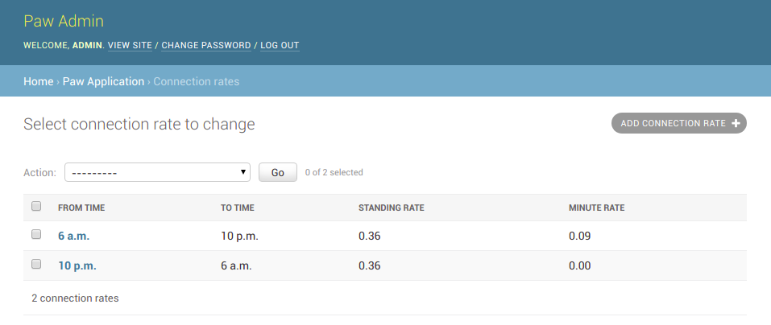
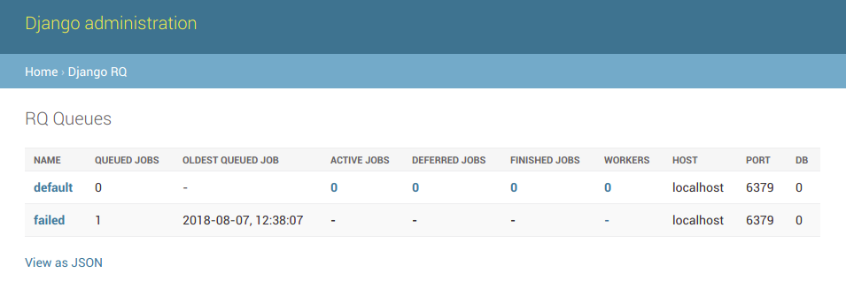

Paw Admin
=========

The Paw admin has two basic functionalities. Setup Connection rates values and visualize RQ queue/job processes.

Connection Rates
----------------

After you run the django application, you can acces the Paw admin using the url `/admin`. In this screen you will find a section Paw Application and the url to setup the Connection Rates.

Connection Rates page:

Django RQ Admin
---------------

After you run the django application, you can acces the Paw admin using the url `/django-rq`.

Using DjangoRQ Admin you can visualize every queued process that finish running. This includes the ones that finish with success or the ones that have failed.

Also, you can access the failed ones and re-queue to be processed again.

DjangoRQ Admin page:

